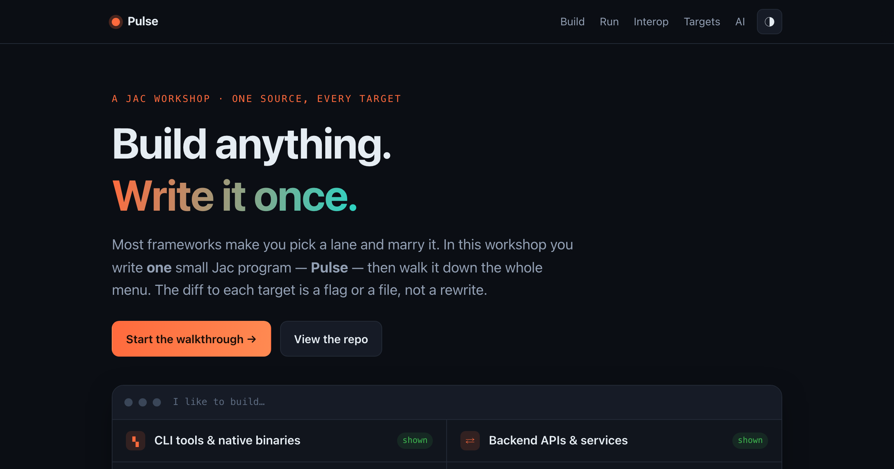

# The Jac Workshop — Pulse

**One Jac source. Every build target.** A hands-on workshop that builds one small
program — **Pulse**, a metric-anomaly narrator — then walks it down the whole
"I like to build…" menu: CLI, REST API, full-stack web, AI agent, package.

### 📖 Live walkthrough → https://jaseci-labs.github.io/the-jac-workshop/

[](https://jaseci-labs.github.io/the-jac-workshop/)

## What's here

| Path | What it is |
|---|---|
| [`pulse/`](pulse/) | The **live-build** — Pulse, ~155 lines of Jac, fanned out to every target |
| [`metrics-workbench/`](metrics-workbench/) | The **capstone** — the deep version (pandas / statsmodels / pyod interop) |
| [`docs/`](docs/) | The GitHub Pages walkthrough (source of the site above) |
| [`WORKSHOP_PLAN.md`](WORKSHOP_PLAN.md) | The full run-of-show (60–90 min) |

## Run Pulse

```bash
cd pulse
jac install

# CLI — every walker is a subcommand, zero extra code
jac enter main.jac seed
jac enter main.jac scan orders        # → {'anomalies': 4, 'indices': [30, 31, 32, 55]}
jac enter main.jac forecast orders 14 # statistics.linear_regression, imported inline
jac enter main.jac narrate orders     # by llm → a typed Insight

# Full-stack web — the SAME walkers, + one .cl.jac page
jac start --dev main.jac              # → http://localhost:8000
```

Every command and output in the walkthrough was captured from the running app.
