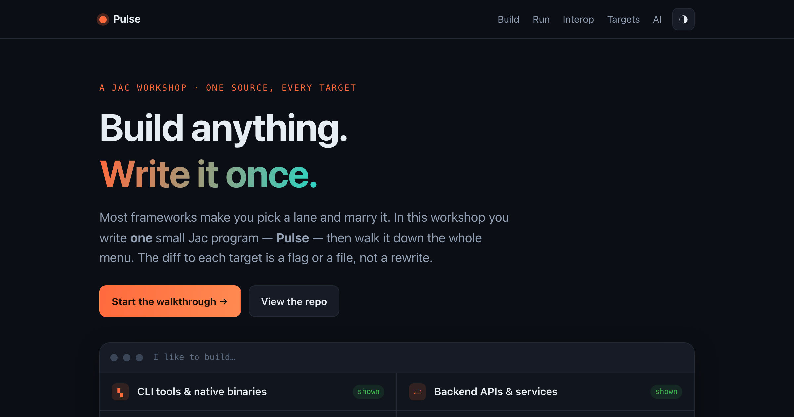

# The Jac Workshop

**One Jac source. Every build target.** A hands-on workshop showing what Jac does
that the rest of the stack can't: native AI (`by llm`), a graph-native database,
seamless Python/JS interop, and one source that compiles to a CLI, a REST API, a
full-stack web app, desktop/PWA, and a pip/npm package.

It ships **two complete, working apps**:

- **[Pulse](pulse/)** — the slim **live-build** (~155 lines of Jac): one small
  program walked down the whole "I like to build…" menu with a near-zero diff to
  each target.
- **[Metrics Workbench](metrics-workbench/)** — the **capstone**: a real analytics
  app where **pandas · statsmodels · pyod** do the heavy lifting — anomaly
  detection, SARIMAX forecasting, and three `by llm` features.

### 📖 Live: **[Walkthrough](https://jaseci-labs.github.io/the-jac-workshop/)** · **[Capstone deep-dive ↗](https://jaseci-labs.github.io/the-jac-workshop/metrics-workbench.html)**

[](https://jaseci-labs.github.io/the-jac-workshop/)

## What's here

| Path | What it is |
|---|---|
| [`pulse/`](pulse/) | The **live-build** — Pulse, ~155 lines of Jac, fanned out to every target |
| [`metrics-workbench/`](metrics-workbench/) | The **capstone** — a full analytics app: pandas · pyod · statsmodels + AI. [**In-depth page ↗**](https://jaseci-labs.github.io/the-jac-workshop/metrics-workbench.html) |
| [`docs/`](docs/) | The GitHub Pages walkthrough (source of the site above) |
| [`WORKSHOP_PLAN.md`](WORKSHOP_PLAN.md) | The full run-of-show (60–90 min) |

## Prerequisites

Jac **0.37+** (tested on 0.37.23). Install it by following the
[official install guide](https://docs.jaseci.org/quick-guide/install/), then check with `jac --version`.

> **macOS arm64 + jac 0.37.23:** if `jac install` fails with
> `_posixsubprocess ... symbol not found in flat namespace`, the binary's
> bundled Python can't create the project venv. Pre-create it with any regular
> CPython 3.14 and re-run: `python3.14 -m venv .jac/venv && jac install`.

## Run Pulse

```bash
cd pulse
jac install

# CLI — every walker is an entrypoint, zero extra code
jac run --no-serve --entry seed main.jac
jac run --no-serve --entry scan main.jac orders        # → {'anomalies': 4, 'indices': [30, 31, 32, 55]}
jac run --no-serve --entry forecast main.jac orders 14 # statistics.linear_regression, imported inline
jac run --no-serve --entry narrate main.jac orders     # by llm → a typed Insight

# Full-stack web — the SAME walkers, + one client page (web.jac)
jac run --dev main.jac                                 # → http://localhost:8000
```

## Run the Metrics Workbench (capstone)

The heavy-interop version — pandas dataframes, pyod anomaly detection,
statsmodels SARIMAX forecasting, and three `by llm` features.

```bash
cd metrics-workbench
jac install
.jac/venv/bin/python data/generate_synth.py data/synth_ecom.csv   # 90 days of e-commerce data

# CLI — same walkers as the dashboard
jac run --no-serve api.jac ingest sales data/synth_ecom.csv
jac run --no-serve api.jac metric sales revenue "gross_revenue - refunds" order_ts
jac run --no-serve api.jac anomaly sales revenue 90     # pyod IForest
jac run --no-serve api.jac forecast sales revenue 30    # statsmodels SARIMAX
jac run --no-serve api.jac narrate sales revenue <run>  # by llm → typed Insight
jac run --no-serve api.jac investigate "what happened"  # agentic by-llm walker

# Full-stack dashboard (recharts time-series + forecast band + AI)
jac run --dev main.jac                                  # → http://localhost:8000
```

Every command and output in the walkthrough was captured from the running app.
